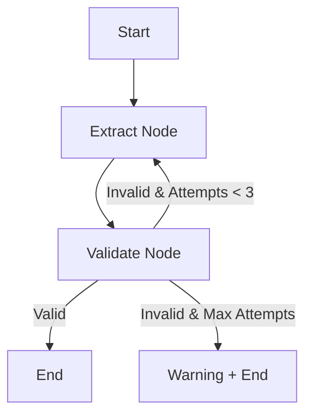

# State Schemas & Structured Output

A robust data extraction pipeline using **LangGraph**, **Instructor**, and **Pydantic** to handle complex, messy, and self-contradictory text inputs.

## Architecture

The project uses a cyclic state machine (Extract-Validate-Repair) to ensure high-fidelity extraction.



### Features
- **Strict Pydantic Validation**: Uses `@model_validator` and `@field_validator` for math consistency and temporal logic.
- **Self-Correction Loop**: Validations errors are fed back into the LLM prompt for iterative repair.
- **Multi-format Support**: Extracts text from `.txt`, `.pdf`, and `.docx`.
- **Advanced CLI**: Rich terminal output with Table, JSON, and YAML support.

## Installation

1. Clone the repository.
2. Install dependencies:
   ```bash
   poetry install
   # or
   pip install -r requirements.txt
   ```
3. Set up your environment:
   ```bash
   cp .env.example .env
   # Add your OPENAI_API_KEY
   ```

## Usage

### Run via Command Line
```bash
# Process a local file as a table
python3 -m src --file data/project_3_chaos.txt

# Output as JSON
python3 -m src --file data/project_3_chaos.txt --format json
```

## Project Structure
- `src/`: Core source code.
- `data/`: Sample project files.
- `examples/`: Guided examples for testing.
